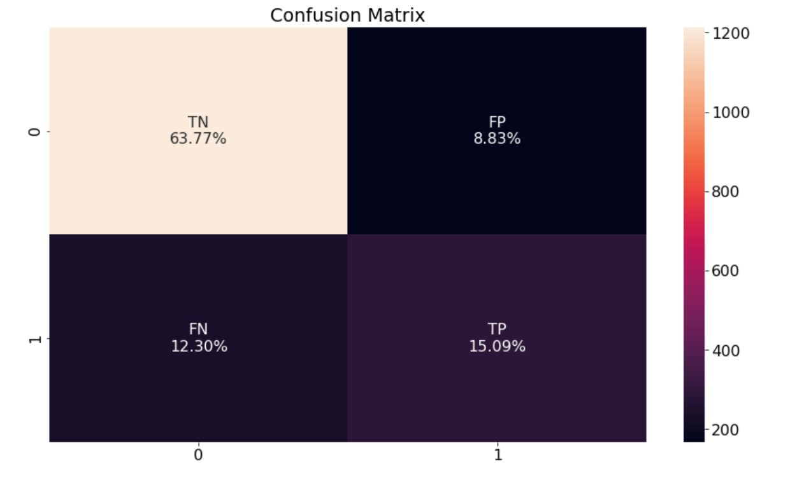

# Predict customer retention ML

# Introduction:
In this project we will explore Logistic Regression type of model and learn more about the subject on these following features:

**Customer ID:** The Id of the customer.

**Gender:** Is the customer male or female.

**SeniorCitizen:** Whether the customer is a senior citizen or not.

**Partner:** Whether the customer has a partner or not.

**Dependents:** Whether the customer has dependents or not.

**Tenure:** Number of months the customer has stayed with the company.

**Phone Service:** Whether the customer has a phone service or not.

**MultipleLines:** Whether the customer has multiple lines or not.

**InternetService:** Customers internet service provider.

**OnlineSecurity:** Whether the customer has online security or not.

**OnlineBackup:** Whether the customer has online backup or not.

**DeviceProtection:** Whether the customer has device protection or not.

**TechSupport:** Whether the customer has tech support or not.

**StreamingTV:** Whether the has a streaming TV or not.

**StreamingMovies:** Whether the customer has streaming movies or not.

**Contract:** The contract term of the customer.

**PaperlessBilling:** Whether the customer has paperless billing or not.

**PaymentMethod:** The customer’s payment method.

**MonthlyCharges:** The amount charged to the customer monthly.

**TotalCharges:** The total amount charged to the customer.

**Churn:** Whether the customer churned or not (Target Column).

# Results:
After testing the model we founds this Accuracy:

> The best Score is **80.57%**

- [Bedoor Alharbi](https://github.com/ibedoor)
- [Sarah Alhugail](https://github.com/SarahAlhugail)
- [Eatidal Almutairi](https://github.com/eatidal)
- [FARAH SIDINA](https://github.com/faro7ah)

